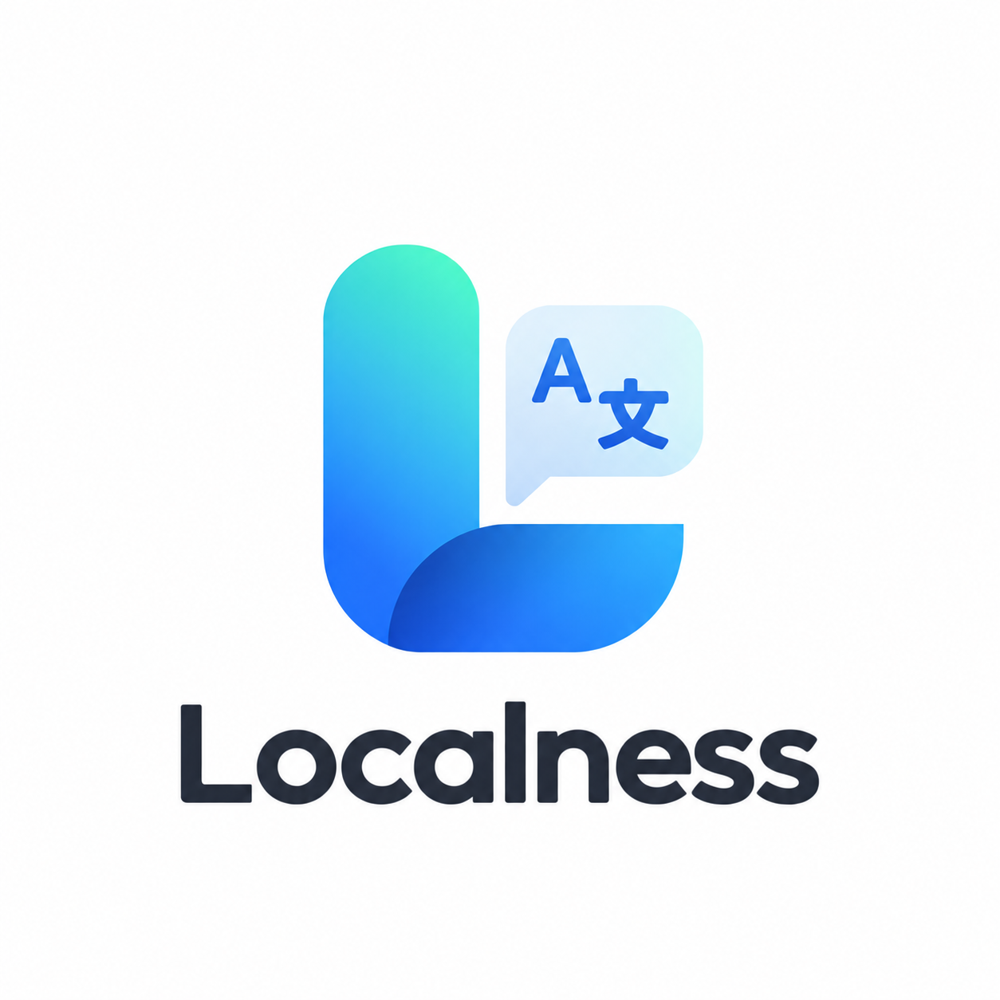

<div align="center">
  
  <h1>Localness</h1>
  <p><strong>A self-hosted CMS for UI screenshots, tags, and i18n keys.</strong></p>
  <p>
    
    
    
    
    
    
  </p>
</div>

---

## What is Localness?

Localness is a content management system for product localization. Instead of managing
translation keys in spreadsheets, it binds three facts together:

1. **What an i18n key is called** — a stable, namespaced identifier (e.g. `common.submit`).
2. **Where it appears** — a region drawn directly on a real UI screenshot.
3. **What it says** — the text in every language your product ships.

A **Page** is a UI screenshot uploaded to a project. On that screenshot you draw **Tags** —
rectangles around real UI elements. Each tag carries an **i18n key**, and the key holds one
text value per configured locale. Everything else in Localness — OCR, the translation table,
releases, export, Git sync, the delivery API — serves that single binding.

It is deliberately **not** a generic headless CMS (it models pages, tags, keys, locales,
releases — nothing else) and **not** a screenshot gallery (a screenshot without tags and keys
is only a starting point).

### Draft vs. Published

Translations have two layers. Editing writes to a **draft**; an explicit publish action
snapshots the draft into the **published** layer, which is what exports, the delivery API,
and MCP tools read. Translators can keep working on drafts without changing what consumers
already see.

## Features

- 📸 **Screenshot-first workflow** — upload UI screenshots as Pages and annotate them in a
  canvas editor built on [Leafer UI](https://www.leaferjs.com/): draw, resize, move, lock,
  and reorder tags with undo/redo support.
- 🔤 **OCR assist** — recognize text inside a tag region ([OCR.Space](https://ocr.space/) API)
  and prefill the source text.
- 🤖 **AI-assisted key naming** — suggest i18n key names from the tag's context via any
  OpenAI-compatible endpoint, with per-feature configuration overrides.
- 🌐 **Translation workspace** — a key × locale matrix with autosave, per-locale
  publish, version history, batch paste-import, and references back to the tags using a key.
- 🏷️ **Releases** — version-like labels (e.g. `v1.3`, `sprint-12`) assigned to keys for
  filtering across the translations table, export, and the delivery API.
- 📦 **Export** — download XLSX (including a painted preview sheet of tags on the source
  screenshots) or JSON (flat, or structured for your i18n framework).
- 🔁 **Git Sync** — two-way sync between Localness and the locale files in your own Git
  repository: push/pull with preview, three-way merge, and UI-based conflict resolution.
- 👥 **Teams & permissions** — teams with invite codes, owner/editor/viewer roles, and
  per-project owners.
- 🔌 **Delivery API & MCP** — a read-only `v1` API (`meta` / `locales/:locale` / `bundle`)
  protected by per-project API tokens, plus an MCP server so AI coding agents can query
  keys directly.
- 🧩 **Skills** — attach project knowledge packages that AI agents consume through the API/MCP.
- 🔔 **Notifications** — in-app notifications for team invitations and collaboration events.
- 🔐 **Authentication** — local username/password accounts (scrypt-hashed), with optional
  Atlassian OAuth restricted by an email-domain allowlist.
- 🗄️ **Pluggable image storage** — keep uploaded screenshots on a local volume, or use
  Qiniu Cloud OSS.
- 🌙 **Dark-first UI** — built with Nuxt UI and Tailwind CSS 4.

## Tech Stack

| Layer      | Technology                                                                 |
| ---------- | -------------------------------------------------------------------------- |
| Framework  | Nuxt 4 (Vue 3, TypeScript) + Nitro server                                  |
| UI         | Nuxt UI, Tailwind CSS 4, motion-v, Leafer UI canvas                        |
| State      | Pinia                                                                      |
| Database   | SQLite via Prisma 7 + better-sqlite3                                       |
| Auth       | nuxt-auth-utils (session + scrypt), optional Atlassian OAuth 2.0 (3LO)     |
| Validation | zod (shared schemas between client and server)                             |
| Tests      | Vitest (unit + API)                                                        |
| Packaging  | pnpm workspaces, Docker (single container + one volume)                    |

## Project Structure

```text
app/                  Nuxt application (pages, components, composables, stores, editor core)
server/               Nitro backend
  api/                REST endpoints (pages, tags, translations, teams, projects, v1 delivery)
  routes/             Auth routes, file upload, MCP endpoint
  helper/             Access control, tokens, i18n, releases, git-sync helpers
  libs/               Prisma client, OCR, AI agents, git-sync engine, storage drivers
shared/               Types, constants, zod schemas and utils shared by app and server
prisma/               SQLite schema and migrations
test/                 Vitest unit tests and API tests
docker/               Docker entrypoint and deployment guide
docs/run-book/        Full product manual (Chinese)
runtime/              Data directory: SQLite database and local uploads
```

## Getting Started (local development)

**Prerequisites:** Node.js ≥ 22 (see `package.json` `engines`) and pnpm 10
(`corepack enable && corepack install`).

```bash
# Install dependencies
pnpm install

# Prepare the database (SQLite file under runtime/db)
pnpm exec prisma generate
pnpm exec prisma migrate dev

# Start the dev server on http://localhost:3000
pnpm dev
```

There is **no public signup** — the first user and every later user are created from the CLI:

```bash
pnpm register
```

## Scripts

| Command           | Description                                             |
| ----------------- | ------------------------------------------------------- |
| `pnpm dev`        | Start the Nuxt dev server                               |
| `pnpm build`      | Production build                                        |
| `pnpm preview`    | Preview the production build locally                    |
| `pnpm lint`       | ESLint check                                            |
| `pnpm typecheck`  | `nuxi typecheck` (vue-tsc)                              |
| `pnpm test`       | Run unit + API tests (Vitest)                           |
| `pnpm test:unit`  | Unit tests only                                         |
| `pnpm test:api`   | API tests (boots a full Nuxt instance on `:4000`)       |
| `pnpm register`   | Create a user account from the CLI                      |

CI (GitHub Actions) gates on `pnpm test` and `pnpm typecheck`.

## Deployment (Docker)

Docker is the only supported deployment path: a single container plus one volume
(`/app/runtime`), which holds the SQLite database and — with the `LOCAL` storage engine —
the uploaded screenshots. **Losing the volume loses the data.**

```bash
# Next to docker-compose.yml:
cp .env.docker.example .env.docker
# edit .env.docker — NUXT_SESSION_PASSWORD (32+ chars) is mandatory

docker compose pull
docker compose up -d
docker compose logs -f localness     # migrations run before the server starts

# Create the first account
docker compose exec localness tsx scripts/register.ts
```

- The entrypoint runs `prisma migrate deploy` on every boot (idempotent).
- Health check: `curl localhost:13000/api/health` → `{"ok":true,"db":true,...}`.
- Pin a release instead of `latest`:
  `LOCALNESS_IMAGE=huacc/localness:1.2.0 docker compose up -d`
- Images are published to Docker Hub (`huacc/localness`) by pushing a semver git tag.

The full deployment guide — upgrades via `update.sh`, backup/restore, AI prompt mounts,
Atlassian OAuth setup — lives in [`docker/README.md`](docker/README.md).

## Configuration

All configuration is environment-based; in Docker it comes from `.env.docker`
(never baked into the image). Highlights (full list in
[`.env.docker.example`](.env.docker.example)):

| Variable                                    | Purpose                                                        |
| ------------------------------------------- | -------------------------------------------------------------- |
| `NUXT_SESSION_PASSWORD`                     | **Required.** Session sealing secret, 32+ chars                |
| `NUXT_SALT_SIZE`                            | scrypt salt size — also a build arg; do not change after go-live |
| `DATABASE_URL`                              | SQLite file URL (default `file:/app/runtime/db/localness.db`)  |
| `PORT`                                      | Listen port (default `13000`)                                  |
| `NUXT_PUBLIC_OSS_ENGINE`                    | `LOCAL` or `QINIU` screenshot storage                          |
| `NUXT_PUBLIC_OSS_BASE_URL`                  | Public base URL for images (`/upload/` for LOCAL)              |
| `NUXT_QINIU_*`                              | Qiniu OSS credentials, bucket and domain                       |
| `NUXT_OPENAI_API_KEY` / `BASE_URL` / `MODEL`| Shared OpenAI-compatible endpoint for AI features              |
| `NUXT_OPENAI_I18N_KEY_*`                    | Per-feature overrides for the key-naming AI                    |
| `NUXT_OCR_API_KEY` / `NUXT_OCR_API_URL`     | OCR.Space configuration                                        |
| `NUXT_OAUTH_ATLASSIAN_*`                    | Optional Atlassian OAuth client                                |
| `NUXT_ATLASSIAN_ALLOWED_EMAIL_DOMAINS`      | Email-domain allowlist — empty means deny everyone             |

## API & MCP for Consumers

Published translations are delivered read-only, per project, protected by API tokens:

- `GET /api/v1/meta` — project metadata, locales, releases
- `GET /api/v1/locales/:locale` — all published keys for one locale
- `GET /api/v1/bundle` — the full published bundle

An MCP endpoint (`/mcp`) exposes the same data to AI coding agents. See
[`docs/run-book/12-api-mcp.md`](docs/run-book/12-api-mcp.md) (Chinese) for details.

## Documentation

- [`docker/README.md`](docker/README.md) — deployment, upgrades, backup, OAuth, AI prompts (English)
- [`docs/run-book/`](docs/run-book/00-menu.md) — full product manual: teams, projects,
  releases, editor, translations, export, Git sync, API/MCP, skills, permissions (Chinese)

## License

**Proprietary — All Rights Reserved. No open-source license is granted.**

Copyright (c) 2026 CHUANCHENG HUA ([@Hwacc](https://github.com/Hwacc)).
See [`LICENSE`](LICENSE) for the full terms. In short:

- Viewing this repository — and in-platform forking — is permitted only to the extent
  required by the hosting platform's terms of service. It grants **no** right to use,
  copy, modify, or redistribute the code outside that platform.
- Any use, reproduction, modification, or distribution, whether commercial or
  non-commercial, requires the Copyright Holder's **prior written permission**.
- `"license": "UNLICENSED"` in `package.json` is npm's marker for *no license granted* —
  it is **not** the public-domain "Unlicense".

For licensing inquiries, contact the Copyright Holder at **mshcccch@gmail.com**
or open an issue in this repository.
