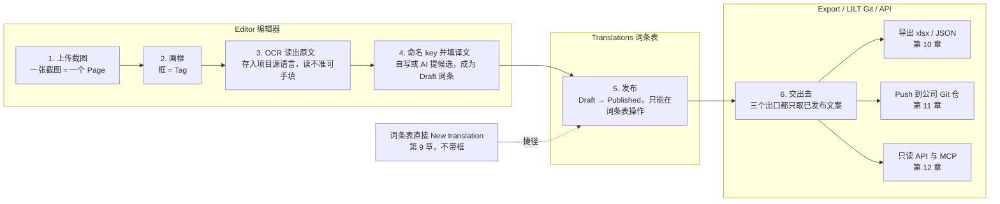
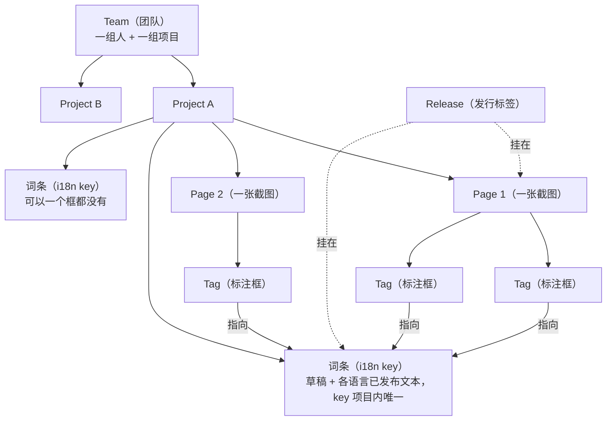

# 2. Localness 是什么

Localness 是**截图标注 + 翻译词条仓库**。你把界面截图传上来，在图上框出每一处文案，给每处文案一个 i18n key 和各语言的译文，发布之后交出去。

## 它解决的问题

一句界面文案要弄清三件事：**用哪个 i18n key**、**它在界面上哪一处**、**它在每种语言下该说什么**。平时这三件事不在一起——截图在设计稿或测试手里，key 在前端代码里，译文在表格里。于是：

- 译者拿着截图，想知道「这句话对应哪个 key」，只能去问开发。
- 开发看到一个 key，想知道「它是界面上哪一处」，只能去翻代码。
- 同一句话在界面上出现三次，表格里就有三行，改一次要改三处。

Localness 做的就是把这些钉在一起：**在截图上框出这句话 → 指定它用哪个 key → 这个 key 的译文只维护一份**。

## 它管什么，不管什么

它只管**界面上会出现的那一行行字**——按钮名、标签、提示语、报错文案——以及这些字在每种语言下该说什么。

| 它做                     | 它不做                                                  |
| ---------------------- | ---------------------------------------------------- |
| 存每处文案的 i18n key 和各语言译文 | 不存结构化内容，没有「文章」「商品」这类内容类型，不生成页面（**不是无头 CMS**，也不是建站工具） |
| 用截图上的框记住这句话在界面上的位置     | 不管页面什么时候上线、长什么样                                      |
| 把已发布文案交出去              | 不主动往前端推：前端、CI、agent 自己来取                             |

「交出去」有三种方式，三个出口都只取**已发布**文案：

- **导出 xlsx / JSON**（第 10 章）：一次性交付，给外包、走人工流程。
- **Push 到公司 Git 仓**（第 11 章）：接 LILT 那条翻译流水线，双向同步。
- **只读 API 与 MCP**（第 12 章）：给 CI、脚本或 agent 自己来取。

## 一条主路径

1. **上传截图**（Editor）：一张截图就是一个 Page。
2. **画框**（Editor）：在截图上拖出一个框，这个框叫 Tag。
3. **读出原文**（Editor）：选中框点 OCR，把框里的文字读成原文；读不准就自己填。原文存在项目的**源语言**下（第 6 章）。
4. **命名并填译文**（Editor）：给这条文案一个 i18n key，自己写或者让 AI 提候选，再把其它语言的译文填上。到这一步它是一条 **Draft** 词条。
5. **发布**（Translations）：草稿要到词条表里发布，发布之后才是 **Published**。编辑器里没有发布按钮，这一步只能在词条表做。
6. **交出去**：导出成 xlsx 或 JSON（第 10 章）、Push 到公司 Git 仓（第 11 章）、或者用 token 调只读 API（第 12 章）。三个出口都只取已发布文案。

不是每条词条都得走完前四步：词条表里可以直接 **New translation** 建一条不带框的词条（第 9 章）。

## 谁属于谁

- **Team（团队）**：一组人加一组项目。进了队才看得见队里的项目。
- **Project（项目）**：翻译工作的单位，通常对应一个前端项目。一个项目有自己的语言集合、一个源语言、一套 key 命名规范，以及它自己的页面和词条。**i18n key 在项目内唯一**，两个项目之间的 key 互不相干。
- **Page（页面）**：一张截图。
- **Tag（框）**：截图上的一个标注框。框自己不存文案，它指向一条词条。
- **词条（i18n key）**：一条文案在各语言下的草稿和已发布文本。**一个 key 可以被多个框共用**：同一句话在界面上出现三次，就画三个框、都绑到同一个 key，译文只维护一份。反过来，一条词条也可以一个框都没有。
- **Release（发行标签）**：挂在页面和词条上的筛选标签，内容多了以后用它把范围收窄（第 7 章）。

框和词条是**多对一**，这是最容易搞错的地方：删掉一个框不会动到词条；删掉一条草稿词条，绑在它上面的框会一起被删掉（第 9 章）。

## Draft 和 Published

一条词条在每个语言下都有两份文本：**草稿**和**已发布**。状态是整条词条的，不是某个语言的：

- 从来没发布过 → **Draft**
- 任一语言的草稿和已发布不一致 → **Draft**。所以发布之后又改了一个字，整条就回到 Draft
- 所有语言的草稿都和已发布一致 → **Published**

**Published 的词条是只读的**——词条表和编辑器里都一样，要改先撤回到 Draft。撤回会把已发布文本清空，这条词条立刻从导出和 API 里消失，直到再次发布。

导出是空的、API 里少了几个 key、Git 推不上去——先回来核对这一节。

## `__draft_` 开头的 key

在编辑器里画了框、OCR 出了原文，但还没给它一个正式 key 的时候，系统会先建一条词条顶着，key 是 `__draft_` 加 5 位短哈希，界面上就显示这个样子。原文相同的框会算出同一个占位 key，所以重复贴同一句话不会建出一堆词条。

它是一条真词条：能填译文，也能被发布、被导出。所以**交付之前一定要把这些占位 key 改成正式名字**，否则 `__draft_a1b2c` 会原样出现在交出去的文件里。唯一会挡住它的是 Git Push——那边会把它标成 **Auto draft key** 并跳过（第 11 章）。