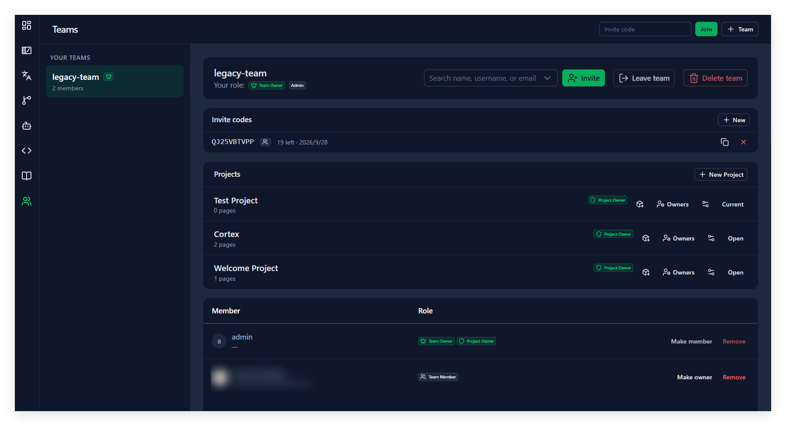
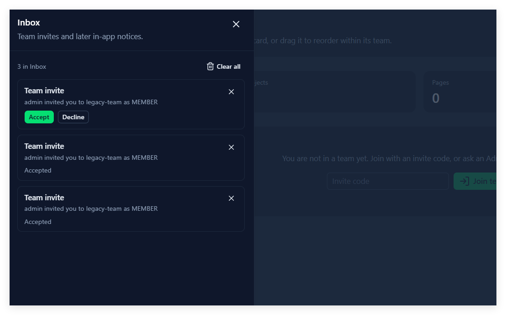

# 5. 团队

## 这一章能做什么

- 用邀请码进一个团队，或者同意别人发来的邀请
- Team Owner：生成、复制、撤销邀请码，按人邀请，改成员角色，移除成员
- 知道离开、降级、移除、删团队分别在什么情况下会被拦下来

## 团队是什么

一个 Team 管一组项目和一批成员。**进了队就能看见队里的全部项目**，不用逐个授权。

队内角色只有两种：**Team Member** 和 **Team Owner**。一个队可以有多个 Team Owner，但**不能一个都没有**——最后一名 Team Owner 不能降级、不能被移除、也不能离开，得先把别人提上来。

建团队只有 Admin 能做：在 **Teams** 页顶部的 **Team** 入口填 **Team name**，点 **Create**，成功会弹 **Team created**。

## 进一个团队

### 用邀请码，不用别人同意

三个地方都能兑码，填进 **Invite code** 再点 **Join**（或 **Join team**）：

- **Teams** 页顶部
- Dashboard 上那张「你还没有团队」的卡片
- 第一次登录时弹出的 **Join a team** 对话框

兑成功弹 **Joined team**，描述是队伍名。如果你已经在这个队里，弹的是 **Already in this team**，角色保持原样——这不是错误。

兑码失败时，不管是码打错、过期、次数用完还是被 Team Owner 撤销，提示都是同一句 `Invalid or expired invite code`，界面不会告诉你是哪一种。连续兑错会被暂时挡住：`Too many invalid invite attempts. Try again later.`

### 被 Team Owner 按名字邀请，要你同意

这条路必须你点头才算数。Team Owner 发出邀请后，你在**铃铛 → Inbox** 里会看到一条 **Team invite**，正文是 `{谁} invited you to {队伍名} as Team Member`，点 **Accept** 或 **Decline**。处理过的行会显示 **Accepted** / **Declined**，没处理的显示 **Pending**。

**Accept 之前你不属于这个队**，队里的项目一个也看不见。

## Team Owner：邀请码

**Teams** 页选中团队，**Invite codes** 卡片（只有 Team Owner 看得到）→ **New**：

- **Role**：兑这个码进来的人是什么角色，**Team Member** 或 **Team Owner**。
- **Max uses**：能兑几次，勾 **No limit** 就是不限。
- **Expires**：到期时间，勾 **Never expires** 就是不过期。不填的话，卡片空态那行写着默认值：`None yet. New codes last 14 days and 20 joins.`

点 **Create**，弹 **Invite code created**，描述里就是那串码。每行显示 `Unlimited` 或 `N left`、`No expiry` 或到期日，行尾两个图标：复制（弹 **Copied**）和 ✕ 撤销（弹 **Invite code revoked**）。

撤销之后这个码就兑不了了，但**已经用它进队的人不受影响**。

## Team Owner：按人邀请

**Invite** 那一栏（只有 Team Owner 看得到），在 `Search name, username, or email` 里输入至少 2 个字符，从候选里选人，点 **Invite**，弹 **Invite sent**。

几件要知道的：

- 候选列表里只有头像、用户名和昵称，**不显示邮箱**。邮箱只参与搜索，搜得到但看不见。
- 选不了的人，选项下面会写原因：**That is you** / **Already on this team** / **Invite already pending**。
- 出现 `More matches — keep typing` 说明候选被截断了，多打几个字。
- 这条路发出去的角色固定是 **Team Member**，界面上没有角色可选。想让人当 Team Owner，等他进队之后在成员表里点 **Make owner**。
- 已经在队里的人再被邀请会失败，角色不变。

## Team Owner：改角色、移除成员

成员表两列 **Member** / **Role**，每行右边三个按钮：

- **Make owner**：提成 Team Owner，弹 **Promoted to Team Owner**。
- **Make member**：降成 Team Member，弹 **Changed to Team member**。
- **Remove**：移出团队，弹 **Member removed**。

按钮按不下去的时候，鼠标停上去会写明原因，见下表。

## 会被拦下来的情况

| 你想做                 | 被拦的原因                       | 界面上写的                                                                                                                                                           |
| ---------------------- | -------------------------------- | -------------------------------------------------------------------------------------------------------------------------------------------------------------------- |
| 把自己降成 Team Member | 你是最后一名 Team Owner          | `A team must keep at least one Team Owner`                                                                                                                         |
| 移除某个成员           | 他是最后一名 Team Owner          | `A team must keep at least one Team Owner`                                                                                                                         |
| 移除某个成员           | 他是某些项目唯一的 Project Owner | `Appoint another Project Owner for {名字} first`                                                                                                                   |
| 离开团队               | 你是最后一名 Team Owner          | `Promote another member to Team Owner first`                                                                                                                       |
| 离开团队               | 你是某些项目唯一的 Project Owner | `Appoint another Project Owner for {项目} first`；如果队里还没有别人可以接手，则是 `Invite someone to this team and appoint them Project Owner for {项目} first` |
| 离开团队               | 你是队里唯一成员                 | `You are the only member — delete the team instead`                                                                                                               |
| 删团队                 | 你不是 Team Owner                | `Only a Team Owner can delete a team`                                                                                                                              |
| 删团队                 | 队里还有别的成员                 | `Remove the other members first`                                                                                                                                   |
| 删团队                 | 队里还有项目                     | `Delete this team's projects first`                                                                                                                                |

离队的确认框写着 `Leave "{队伍名}"? You lose access to its projects and need a new invite to come back.`，按钮是 **Leave**，成功弹 **Left team**。

删团队的确认框写着 `Delete "{队伍名}"? This cannot be undone. Its invite codes and any pending invites are dropped.`——邀请码和还没处理的邀请会一起作废。成功弹 **Team deleted**。

## Inbox

铃铛打开 **Inbox** 抽屉，顶部写着 `N in Inbox`，右边是 **Clear all**。每条消息自己带一个 ✕，可以单删。

**Clear all 要小心。** 它的确认框写得很直白：`Delete every notification? Pending invites go too, and the sender is not told — you will need a new invite to join that team.` 也就是说，还没处理的邀请会被一起清掉，而且**不会通知邀请你的人**——他以为发了，你这边什么都没收到，只能请他重发一次。

## Project Owner 也在这一页

团队详情的 **Projects** 卡片里，每个项目行上有一个 **Owners** 入口，能看和改这个项目的 Project Owner 名册：**Add Team Member** 选人，点 **Add**，弹 **Project Owner added** / **Project Owner removed**。一个 Project Owner 都没有时显示 `No Project Owners. Ask an Admin to appoint one.`

Project Owner 是什么、谁能任命，见第 6 章。

## 做错了会怎样

| 你看到                                                                   | 原因                                                                                                     |
| ------------------------------------------------------------------------ | -------------------------------------------------------------------------------------------------------- |
| `Invalid or expired invite code`                                       | 码打错、过期、次数用完，或被 Team Owner 撤销了——四种情况提示都一样，找 Team Owner 重新生成一个         |
| `Too many invalid invite attempts. Try again later.`                   | 短时间内兑错太多次，等一会儿再试                                                                         |
| `Type at least 2 characters`                                           | 邀请搜索框里字太少                                                                                       |
| `No matching user`                                                     | 搜不到人。对方得先有账号（第 3 章）；邮箱只参与匹配，列表里不显示                                        |
| 发了邀请，对方说没收到                                                   | 邀请在对方的 Inbox 里，要点**Accept** 才入队；对方如果按过 **Clear all**，邀请就没了，得重发 |
| 邀请某人时选项是灰的                                                     | 选项下面写了原因：是你自己、他已经在队里、或者邀请还没处理                                               |
| **Make member** / **Remove** / **Leave team** 按不下去 | 见上面那张「会被拦下来的情况」                                                                           |
