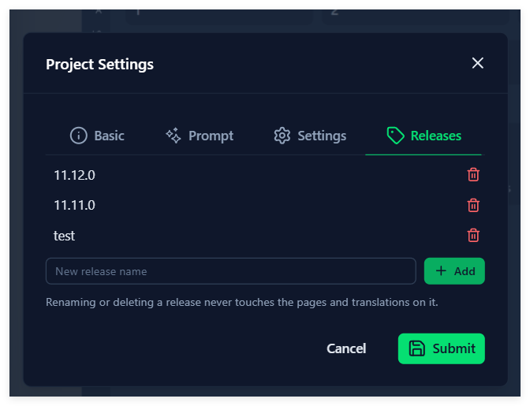
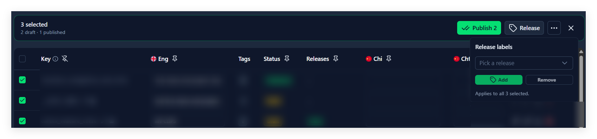

# 7. 发行标签（Release）

## 这一章能做什么

- 建、改名、删发行标签（Project Owner）
- 用 Workspace Bar 上的发行下拉切换「当前在看哪个发行」
- 给页面挂标签
- 给词条挂标签，包括一次挂一批

## 发行标签是什么

发行标签（Release）是挂在**页面**和**词条**上的一个筛选标签，回答的是「这条内容属于哪一次发版」。

它只在两件事上有用：

- 内容多起来之后缩小范围，只看这次要发的
- 按发行导出（第 10 章）

它不是内容的副本。一条词条挂两个发行，文案还是那一份，改一次两边都变——同一个 key 不会因为挂了几个发行就有几份文本。

**标签挂在词条上，不挂在画框上。** 编辑器里那个字段下面写得很直白：`Labels on the translation entry, not on this box.` 三个框共用一条词条，三个框看到的是同一组标签；删掉其中一个框，标签还留在词条上。

[image 概念图：一个 Project 下两个 Release 标签，几个 Page 和几条词条各自挂在不同标签上，其中一条词条同时挂着两个标签，画框和词条之间用线连起来说明标签在词条这一侧]

## 当前发行：一个下拉管三个地方

Workspace Bar 靠右有一个发行下拉，选项依次是 **All releases**、每个发行名、**Unassigned**，Project Owner 还会多一项 **Manage releases…**。

这一项表达的是「我现在在看哪个发行」，选完立刻作用于三个地方：

| 哪里                 | 变什么                             |
| -------------------- | ---------------------------------- |
| 编辑器左侧的页面列表 | 只列出挂了这个发行的页面           |
| 词条表               | 只列出挂了这个发行的词条           |
| 导出                 | 范围跟着收窄到这个发行（第 10 章） |

**All releases** 就是不过滤。**Unassigned** 是「还没挂任何发行」，刚建的项目里所有内容都在这里。

这个选择**存在你自己这台浏览器上，一个项目一份**，不是团队设置。换台机器、换个同事，看到的都是各自选的那个发行。下次打开同一个项目，会回到上次选的那个。

下拉**只在项目里已经有发行标签时出现**。一个都没有的时候，Project Owner 仍然看得到它（只有 Project Owner 能建出第一个），Team Member 看不到。

### 新建内容的默认标签

正筛着某个发行时新建内容，它会自动挂上这个发行——不然一建出来就从你眼前消失了：

- 新建页面：**Releases** 字段预选当前发行
- 词条表的 **New translation**：同样预选当前发行
- 编辑器里给一个框绑一条新词条：同样

筛着 **All releases** 或 **Unassigned** 时，新建的内容不带标签。

给一条**已经存在**的词条挂标签是另一回事：编辑器里那个字段显示的是这条词条**当前**的标签，不是当前筛选。保存时也不会把别人原来挂的标签洗掉。

## Project Owner：建、改名、删

两个入口，打开的是同一个 **Project Settings** 弹窗的 **Releases** 标签页：

- Workspace Bar 发行下拉最下面的 **Manage releases…**
- **Project settings** → **Releases**

**这个标签页只有 Project Owner 看得到。** Team Member 打开同一个弹窗，只有 **Basic** / **Prompt** / **Settings** 三个标签页；发行下拉里也没有 **Manage releases…**。

- **新建**：在 **New release name** 里填名字，点 **Add**（回车也行）。名字是空的时候 **Add** 是灰的。新标签排在最下面。
- **改名**：点标签名，就地变成输入框，改完回车或点到别处生效，`Esc` 取消。
- **删除**：行尾的垃圾桶图标，弹确认框。

一个标签都还没有时，这里写着 `No releases yet. Create one to group pages and translations by the version they shipped in.`

重名会被拦下来，而且**不区分大小写**：已经有 `v1`，就建不出 `V1`，`v1 ` 也不行——在下拉里这几个名字看不出区别。报错是 `A release with this name already exists`。

这个标签页底部固定写着一句 `Renaming or deleting a release never touches the pages and translations on it.`，删除确认框里又用这个标签的名字说了一遍：`Delete “v1”? Pages and translations are not deleted — they simply stop being filterable by this release.`

两句话是一个意思：删的只是一个标签。挂过它的页面和词条都还在，回到 **Unassigned**。如果你正筛着这个发行，下拉会自动切回 **All releases**——不会让你对着一个空列表猜刚才发生了什么。

## 给页面挂标签

编辑器左侧的页面列表 → 页面行上的 ⋮ → **Page Settings** → **Releases** 字段。新建页面时是同一个弹窗的同一个字段。

字段是**多选**：点开下拉勾一个或多个发行；选中之后显示成一个个小标签，每个标签右边的 ✕ 单独去掉它。什么都没挂时占位文字是 `Not in any release`。

下拉里**只能选已经存在的发行**，敲不出一个新的。要新建，找 Project Owner。

## 给词条挂标签

单条：**编辑器**里双击一个框打开 **Info** 弹窗（第 8 章），或者**词条表**里改草稿行的编辑弹窗——两个地方是同一个 **Releases** 字段，改的是同一条词条。已发布的词条要先撤回成草稿才能改。

一次挂一批（词条表）：勾选多行 → 工具栏上的 **Release**：

- 先在 **Pick a release** 里选一个发行，再点 **Add** 或 **Remove**
- 这个下拉默认选好**你当前正筛着的那个发行**，所以「把选中的都归到当前发行」是两步；筛着 **All releases** 或 **Unassigned** 时它默认是空的，得自己挑一个
- 底下写着 `Applies to all N selected.`，N 是勾选的行数
- 不分草稿和已发布：标签挂在文案旁边，不在草稿或已发布的某一侧
- 加和减都按集合算，重复加不会报错

词条表里还有一列 **Releases**，显示每条词条挂了哪些：空着是 `—`，最多显示两个，再多折叠成一个 `+N`，鼠标移上去能看到全部。项目里一个发行标签都没有时，这一列不出现。

## 做错了会怎样

| 你看到                                                         | 原因                                                                                                    |
| -------------------------------------------------------------- | ------------------------------------------------------------------------------------------------------- |
| 编辑器左侧页面列表空了，写着`No pages in “v1”.`            | 当前发行下确实没有页面，不是项目空了。点**Show all pages**，或者把下拉切回 **All releases** |
| 只改了一个框的标签，编辑器里另外几个框跟着变了                 | 标签挂在词条上，这几个框共用同一条词条                                                                  |
| 已发布的词条里 Releases 字段是灰的                             | 已发布只读，先撤回到草稿才能改                                                                          |
| 改完一个页面的标签，当前页跳到了别的页面                       | 这一页被移出了当前发行，编辑器自动换到第一张还在的页面                                                  |
| 删了一个发行，内容一条没少                                     | 正常，删的只是标签                                                                                      |
| 同事看不到你选的发行                                           | 这个选择存在你自己的浏览器里，不是团队设置                                                              |
| 词条表里找不到**Releases** 列                            | 这个项目还没有任何发行标签                                                                              |
| 页面或词条的 Releases 字段里敲不出新发行                       | 这里只能选已有的；新建在**Project settings** → **Releases**                                |
| 找不到**Manage releases…** 和 **Releases** 标签页 | 你不是这个项目的 Project Owner；Team Owner 身份不带 Project Owner 权限（第 6、14 章）                   |
| 建标签时提示`A release with this name already exists`        | 重名，不区分大小写                                                                                      |
| 改名撞上另一个标签的名字，报错后名字没变                       | 改不动就是没改成，原来的名字还在                                                                        |
| 把标签名清空再回车，什么都没发生                               | 空名字不会提交，也不会把标签删掉；要删用右边的垃圾桶图标                                                |
