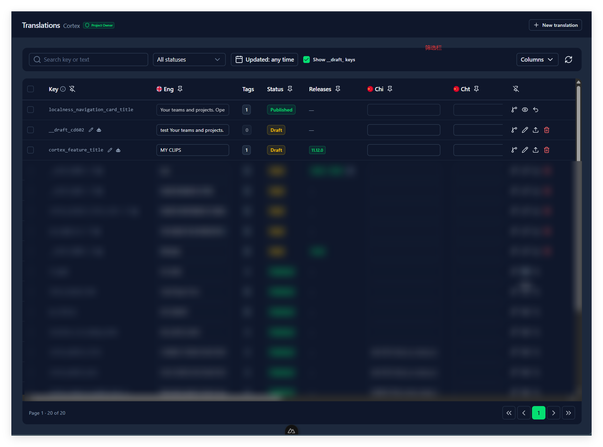

# 9. 词条表（Translations）

## 这一章能做什么

- 看这个项目的全部词条，一列一个语言
- 不画框，直接建一条词条
- 改草稿、发布、撤回、删草稿
- 查一条词条被截图上的哪些框引用
- 点开一行，按语言读全文、就地改，还能逐行翻
- 批量发布、撤回、删除、挂发行、纳入或排除 Git 同步
- 把词条复制或移动到另一个项目
- 从已有的 JSON / xlsx 语言文件导入词条（Project Owner）

## 表格长什么样

顶部一行是筛选栏，中间是表格，底下是分页。表头写着 **Translations** 和当前项目名，右上角是 **New translation**。

## 筛选栏

| 控件                           | 做什么                                                                                                           |
| ------------------------------ | ---------------------------------------------------------------------------------------------------------------- |
| **Search key or text**   | 搜 key，也搜**任意语言**的草稿文本——不用管原文存在哪个语言下                                             |
| 状态下拉                       | **All statuses** / **Draft** / **Published**                                                   |
| 日期                           | 默认**Updated: any time**。选一天，或选一段起止日期；按钮上显示的就是你选的日期，右边 **Clear** 清掉 |
| **Show __draft_ keys** | 默认勾上，显示编辑器给没命名的框自动建的占位 key。鼠标停上去有说明：它和 Draft 状态筛选不是一回事                |
| **Columns**              | 显示或隐藏语言列                                                                                                 |
| 刷新按钮                       | 重新拉一遍列表                                                                                                   |

日期筛的是**最后更新时间**，按你本地的一整天算。

**筛选是按项目记在你这台浏览器上的**，和发行筛选一样：切走再切回来，还是你上次的样子。

**表格永远按最后更新时间倒序**，没有排序按钮。刚改过的排在最前面——不过在当前这一页里改一格，行不会跳走；点刷新才会重排。

## 每一列

| 列                 | 说明                                                                                                                               |
| ------------------ | ---------------------------------------------------------------------------------------------------------------------------------- |
| 复选框             | 勾选做批量操作                                                                                                                     |
| **Key**      | 草稿的 key 旁边有铅笔（`Rename this draft key`）和机器人（`Name this key with AI`）两个小图标；已发布的 key 是纯文本，没有图标 |
| 源语言列           | **第一列语言就是原文**（第 6 章的 Source language）。这条词条的原文就存在这一格，没有第二个地方放它                          |
| **Tags**     | 这条词条被几个框引用。有引用时点一下打开预览；是 0 时灰着，点不动                                                                  |
| **Status**   | **Draft** 或 **Published**                                                                                             |
| **Releases** | 挂了哪些发行标签，最多显示两个，多的折成`+N`。项目里没有发行标签时这一列不出现（第 7 章）                                        |
| 其它语言列         | 一个语言一列，顺序沿用项目自己的语言顺序                                                                                           |
| 操作               | 四个图标按钮，见下面「一行上的四个按钮」                                                                                           |

### 一行上的四个按钮

| 图标        | 说明                                                                                                                                                  |
| ----------- | ----------------------------------------------------------------------------------------------------------------------------------------------------- |
| 分支        | **Git 同步开关**。鼠标停上去写着 `In Git sync — click to keep it out` 或 `Kept out of Git sync — click to include it`；被排除时图标是红的 |
| 铅笔 / 眼睛 | 草稿是**Edit**，已发布是 **View**——都打开右侧抽屉，已发布时文本和 key 是灰的                                                                     |
| 上传 / 撤销 | 草稿是**Publish**；已发布是 **Revert to draft**                                                                                           |
| 垃圾桶      | 只有草稿才有，红色，**Delete**                                                                                                                  |

## 改一条词条

**改译文**：直接在语言那一格点进去改。按 `Enter` 或点到别处提交，提交前不用保存按钮。

- 只有**草稿**能改。已发布的行输入框是灰的（先撤回到草稿）。
- 改**源语言**那一格，等于改这条词条的原文。

**改 key（改名）**：点 key 本身，或者点铅笔图标，就地变成输入框。

- `Enter` 提交，`Esc` 取消。
- 名字留空会弹 **Key is required**，改不动。
- 只有**草稿**能改名。已发布的 key 保住名字——Key 表头那个 i 图标里写着：`A draft key can still be renamed: click it, or use the pencil. A published key keeps its name — revert it to draft first.`
- 改名后这一行**留在原地**，不会因为更新时间变了而跳走。

**改更多东西**（各语言一起看、原文、发行标签、Git 同步）：点铅笔或眼睛，打开右侧的抽屉。

- **在行的空白处双击**也打开这个抽屉；输入框、按钮上双击不算——那是选词和连按两次按钮。
- **原文一段常开**，带 **Source** 徽章；其余语言折在**手风琴**里，点开哪条看哪条，可以同时开好几条用来对照。顺序都按项目自己的语言顺序。
- 点进去就能改文本，点到别处就存，**没有保存按钮**。
- key 旁边有**机器人按钮**（草稿才有），点了在下方出 **AI suggestion** 面板；选好候选按勾，名字填进 key 并直接存下。和新建弹窗、表格展开行是同一套。
- 已发布时**文本和 key 是灰的**，改不了；**Releases 和 Git sync 还能改**（第 7 章）。顶上那条提示里带 **Revert to draft** 按钮，点了先问一次，确认后这条变回草稿，文本和 key 当场解锁、可以直接改。
- 底部只有 **Close**，加左右两条箭头逐行翻，中间的位置指示是`3 / 20`，**只在本页内翻**。

### 建一条新词条

**New translation** 打开新建弹窗。建完之后要改，就回表格点那一行——编辑都在表格和抽屉里。

**Key** 和源语言那一格都必填，缺一个点 **Create** 会弹 **Key is required** / **Source text is required**。保存成功弹 **Created**。

正筛着某个发行时，新词条的 **Releases** 会预选那个发行（第 7 章）。

### 名字被占用了怎么办

| 情形                                       | 结果                                                                                                                                                          |
| ------------------------------------------ | ------------------------------------------------------------------------------------------------------------------------------------------------------------- |
| 改名改成一个**已经存在**的 key       | 直接拒绝。报错会说清是哪一种：原文相同是`Key "x" already exists for the same source text`，原文不同是 `Key "x" already belongs to a different text: "…"` |
| 新建词条时填了一个已存在的 key             | 同上，拒绝                                                                                                                                                    |
| 在**编辑器**里给框填一个已存在的 key | 不一样：这条框会直接挂到那条已有词条上（第 8 章）                                                                                                             |

一句话：**在词条表里，key 是唯一的，撞上了就得改名字**；「复用已有词条」是编辑器的行为，不是这里的。

### 让 AI 给草稿起名

点草稿行 key 旁边的**机器人图标**，表格里会在这一行下面**展开一块面板**（不是弹窗），写着 **AI suggestion**，里面是候选、匹配度、以及和编辑器里同样的那几张提醒卡（第 8 章）。等的时候显示 **Thinking…**，可能要十几秒。再点一次机器人图标就收起这块面板。

**一次只能问一条**：只要有一条还在生成，所有机器人图标都是灰的。答案只认提问的那一行——生成期间翻页或换项目，也不会把某条词条的答案显示到另一条下面。

- 选中候选只是把它**填进这一行的 key 输入框**，你还要按 `Enter`（或点到别处）才真的改名。
- 一次只展开一块面板。
- 这一处生成**只有项目层的 Prompt 生效**——页面和标签的 Prompt 取不到，因为一条词条的框可能散在好几页上（第 6 章）。
- 已发布的 key 没有这个图标。

## 发布和撤回

**发布**把草稿文字复制成已发布文字。

- 单行：点上传播图标，或者勾选后点工具栏的 **Publish N**。
- 提示里的数字是**语言行数**，不是词条条数：一条词条只有 2 个语言的草稿有变化，就写 `2 locale row(s) published`。
- 没有任何语言的草稿和已发布不一样时，弹的是 **Nothing to publish**，说明 `No draft text on the selected rows differs from what is already published.`

**撤回**（**Revert to draft**）把已发布文字**清空**，这条词条回到草稿。

- 撤回确认框写着 `Revert “x” to draft? It will drop out of published export until you publish again.`
- 撤回之后它就从导出和对外 API 里消失了，草稿文字还在，改完可以再发布。
- **已发布的词条不能直接删**，先撤回。

## 删除

只有草稿能删，两个入口：行尾的垃圾桶图标，或勾选后走批量的 **Delete N draft**。

确认框会点名后果：

- 一条：**Delete translation** / `Delete draft key “x”? This will also delete 3 bound tag(s).`
- 一批：**Delete translations** / `Delete 2 draft key(s)? This will also delete 5 bound tag(s). Published keys in your selection are skipped.`

**删 key 会连截图上的框一起删掉。** 框没了就是没了，截图还在、词条没了——这一点和编辑器里删框（只去标注）刚好相反。

批量删除是逐条删的，有失败会照实报：标题变成 **Partially deleted**，正文写 `N deleted, M failed`。

## 看这条词条被哪些框引用

**Tags** 列的数字点一下，右侧滑出预览（标题 `Tags · <key>`，说明 `Read-only screenshot with boxes. Edit opens the Editor.`）：

- 左边是 **Pages** 列表，每条写着这一页上有几个框。
- 右边是那张截图，框按它自己的颜色画出来，外面还套一圈高亮边。
- 这一页没有绑框时写 `No tags bound to a page.`
- 底部 **Close** / **Edit**：**Edit** 跳到编辑器并选中那个框（第 8 章）。
- 一条 key 在同一页上有**多个**框时，跳过去选中的是第一个。

## 批量操作

勾选若干行之后，表格上方出现一条工具栏，写着 `N selected`；草稿和已发布混选时会补一行 `X draft · Y published`。

| 动作                  | 怎么做                                                                              |
| --------------------- | ----------------------------------------------------------------------------------- |
| 发布                  | 工具栏上的**Publish N**（只对选中的草稿生效）                                 |
| 挂发行 / 去掉发行     | **Release** 按钮弹出的小面板（第 7 章）                                       |
| 撤回已发布            | ⋯ 菜单 →**Revert N published**                                              |
| 删除草稿              | ⋯ 菜单 →**Delete N draft**（红色）                                          |
| 纳入 Git 同步         | ⋯ 菜单 →**Include in Git sync**                                             |
| 排除 Git 同步         | ⋯ 菜单 →**Exclude from Git sync**                                           |
| 复制 / 移动到别的项目 | ⋯ 菜单 →**Copy N to another project** / **Move N to another project** |

**一次只作用于一侧**：发布只认草稿，撤回只认已发布，删除只认草稿。选中的行里另一半会被跳过（确认框里会写明）。**挂发行 / 去掉发行是例外** —— 标签挂在词条上、不属于「草稿那一侧」，所以它对选中的行一视同仁，已发布的也一起改（这一点和第 8 章编辑器里那个 Releases 选择器不同：那边在已发布时是禁用的）。

**每次列表刷新都会清空勾选**，翻页也一样——所以勾完之后先做完动作再翻页。

Git 同步那两项是活的：选中的行**全都开着**时 **Include** 是灰的，**全都关着**时 **Exclude** 是灰的。做完弹 **Included in Git sync** / **Kept out of Git sync**，正文写 `N translation(s) updated`。被排除的 key 不会进 Pull / Push，但**照样从已发布 API 里取得到**（第 11、12 章）。

## 复制与移动到另一个项目

⋯ 菜单里的 **Copy** / **Move**，选中一个目标项目（只能选你看得见的、且不是当前这个）。弹窗标题分别是 **Copy translations** / **Move translations**，正文说清这次要动几条、目标是谁：

- 复制：`N translation(s) will be added to the project below. <当前项目> is left as it is.`
- 移动：`N translation(s) will be removed from <当前项目> and added to the project below.`

两件事要提前知道：

- **只带走各语言的文案**，不带发行标签、不带截图上的框、也不带 Git 同步的状态。
- **移动之后，这条项目里原来指着它的框还在原地，但失去了绑定**——框变成一个空框，要重新挂词条。弹窗里也写着这句。
- 选中的行里有**已发布**的词条时，会多一句警告：`A published translation arrives published — it goes live in the target's export and API straight away.` 复制过去就是已发布状态，直接能被对方导出。

结果用一条提示汇报：`3 copied to 目标项目`，撞名被跳过的会跟一句 `2 skipped, already there: key_a, key_b`，失败的写 `N failed`。全都没成功时标题是 **Nothing copied** / **Nothing moved**。

## 从语言文件导入

页面右上角 **New translation** 左边的 **Import**，**只有 Project Owner 看得到**。它面向的是"这些文案早就在用了"的情况，所以：

- 导入的文案**直接是已发布状态**（草稿和已发布写同一份），马上能被导出和 API 取到。
- **新建的词条默认不参与 Git 同步**，要同步请在表格里手动 **Include in Git sync**。覆盖的已有词条保持原来的设置。

抽屉里分三步：

1. **Files**：选文件。两种格式二选一：
   - 任意多个 `.json`，**一个语言一个文件**（如 `en.json`、`zh-CN.json`）。可以一次多选，也可以分几次选，后选的会追加进列表，同名文件替换前一个；每个文件右边的 × 可以移除。选 `.xlsx` 会清空已选的 JSON。嵌套结构会用点号拼成 key，`{"login": {"title": "…"}}` 变成 `login.title`；数组会被跳过并提示。
   - 一个 `.xlsx`：第一行是表头，必须有一列叫 `key`，其余每列一个语言。本平台导出的表（带 `id` / `key_id` / `pic` 列）也能直接导回来，那几列会被忽略。多个 sheet 时可以选用哪一个。
2. **Locales**：每个文件或每一列对应项目的哪个语言。系统先按文件名或表头猜一个（大小写、`-` 和 `_` 不区分，`en-US` 会猜成 `en`，`English` 这种语言名也认），猜不出来的是 **Ignore**，需要你手动选。选成 **Ignore** 的不会导入。
3. **Review**：点 **Preview** 后按四类列出：
   - **new**：项目里还没有的 key，会新建。
   - **changed**：项目里已有、但文字不同。逐条显示旧文字和新文字，**勾上的才会覆盖**，没勾的保持原样。这条词条如果有还没发布的草稿，会标出 `Unpublished draft will be replaced`。
   - **unchanged**：文字完全一样，什么也不做。
   - **skipped**：不会导入，展开可以看原因。

   还可以选一个发行标签，**文件里的所有词条**（包括 unchanged 的）都会挂上它。最后点 **Import N key(s)**，一次写完，中途出错就整批不写。

几条规则：

- 首尾空白会去掉，换行统一成 `\n`；数字和布尔值会转成文字；空值当"没有翻译"。
- **同一个 key 出现多次时，用最后一个非空的值**，不会报错，但预览的 **Duplicates in the files** 里会逐条列出：在哪几行、采用了哪个值、丢掉了哪些值（画删除线）。几处文字完全一样的不逐条列，只汇总成一句 `… with identical text. Nothing is lost.`
  - JSON 里嵌套写法（`{"login": {"title": …}}`）和带点的写法（`"login.title"`）会拼出同一个 key，提示里会写明每一行是哪种写法。
  - xlsx 里是**按格子合并**：每个语言各取最后一个非空的格子，后面一行的空格子不会把前面的翻译清掉。
  - key 前后有空格会被去掉；去掉后和别的 key 重名，也按重复处理。
- 两个文件（或两列）映射到同一个语言时，第 2 步会写明它们有多少个 key 重叠、其中多少个文字不同；不同的以列表里靠下的那个为准。
- 一个新 key 在**源语言**下没有文字，会被跳过（原因 `No text in the source language`）。项目里已有的 key 不受这条限制，所以只导一个 `zh-CN.json` 给现有词条补翻译是可以的。
- 以 `__draft_` 开头的 key 和空 key 会被拒绝。
- 不符合项目 key 命名规范的名字**照样导入**，只在预览里提示一句——这些名字已经写在代码里了，不能改。
- 项目没配置的语言会被忽略，预览里会列出来。
- 文件里同时出现 `{name}` 和 `{{name}}` 两种占位符写法时会警告：通常说明混进了另一套 i18n 框架的文案。

## 做错了会怎样

| 你看到                                                                               | 原因                                                                          |
| ------------------------------------------------------------------------------------ | ----------------------------------------------------------------------------- |
| 表格空着写`No keys yet. Create tags in the editor to populate this table.`         | 这个项目还没有词条。可以先在编辑器里画框 OCR，或者点**New translation** |
| 想改某一格，输入框是灰的                                                             | 这一行已发布，先**Revert to draft**                                     |
| key 旁边没有铅笔和机器人图标                                                         | 同上，已发布的 key 保住名字                                                   |
| 改名时弹**Key is required**                                                    | 名字不能留空                                                                  |
| 改名报`Key "x" already belongs to a different text`                                | 这个名字是另一条词条的，换一个名字                                            |
| **Publish** 是灰的，提示 `Nothing to publish — no draft text on this entry` | 这条词条没有哪个语言的草稿和已发布不一样                                      |
| 发布后提示**Nothing to publish**                                               | 同上，选中的行里没有真正需要发布的                                            |
| 发布提示里的数字比勾选的行数大                                                       | 提示数的是语言行数，不是词条数                                                |
| 撤回之后导出里没有这条词条了                                                         | 正常。撤回会把已发布文字清空，要再发布一次才会回去                            |
| 找不到垃圾桶图标                                                                     | 已发布的词条不能直接删，先撤回                                                |
| 表格里看不到刚在编辑器里建的`__draft_` 词条                                        | **Show __draft_ keys** 被取消了勾选                                   |
| 勾好的行突然不勾了                                                                   | 列表刷新或翻页会清空勾选                                                      |
| 复制过去的词条没有发行标签                                                           | 复制只带文案，标签要重新挂                                                    |
| 移动之后截图上的框空了                                                               | 移动不带框的绑定，回编辑器重新挂一条                                          |
| 表格里搜不到某条词条                                                                 | 搜索只认 key 和草稿文本；也可能是状态、日期或发行筛选把它挡住了，逐个清掉再看 |
| 页面上没有 **Import** 按钮                                                     | 只有 Project Owner 能导入                                                     |
| 导入的 xlsx 报 `has no column named “key”`                                     | 表头第一行里要有一列正好叫 `key`                                              |
| 导入后 Pull / Push 里没有这些词条                                                    | 导入新建的词条默认排除在 Git 同步之外，手动 **Include in Git sync**      |
