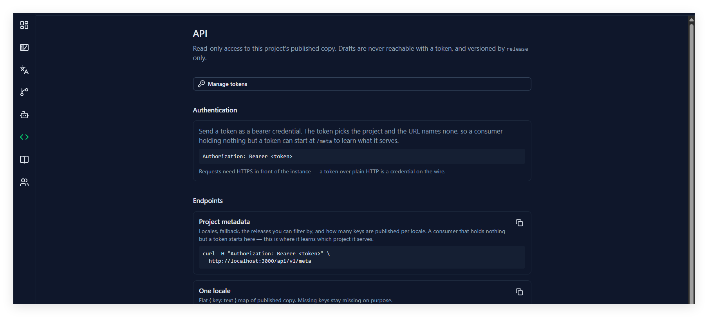
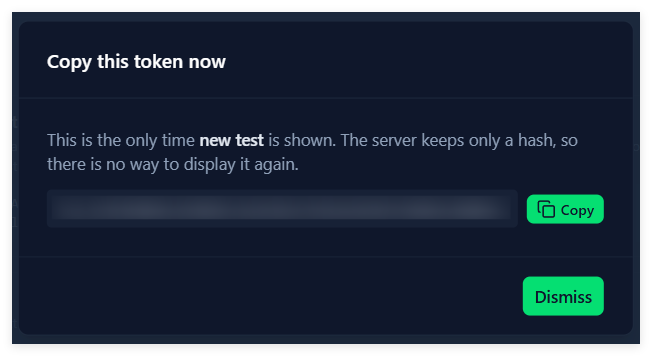

# 12. 对外 API 与 MCP

## 这一章能做什么

- 给自己发一枚 token，给 CI、别的服务或 agent 用
- 用 HTTP 端点取**你指定的项目**的已发布文案
- 把同一枚 token 配进 MCP，让 agent 自己查，不用你写客户端

## 这一页在哪

左侧栏的 **API**。页头写着：

> Access to published copy. Drafts are never reachable with a token, and versioned by `release` only. A token is read-only unless you mint it as `write`, which also lets a design tool import a frame as a page.

**文档和 token 抽屉对所有 Team Member 可见**——消费这个项目的人不一定管这个项目。页面从上到下是：**Manage tokens** 按钮、**Authentication**、**Endpoints**（可复制的例子）、**Importing from a design tool**、**From the browser or Node**、**MCP**。

**这一页不随项目切换**：顶部没有 Workspace Bar（和 **Dashboard** 一样）。因为 token 属于**你**、由它自己指定能碰哪些项目，所以这一页没有任何内容属于「当前项目」。抽屉里每枚 token 都自带 `Team · 项目` 标签，比看顶部那条更准。

## 能取到什么，取不到什么

|                               |                                                                                                                         |
| ----------------------------- | ----------------------------------------------------------------------------------------------------------------------- |
| **只有已发布**          | 草稿一律取不到。某条词条在这个语言还没发布，它就**不出现**，而不是返回空字符串                                    |
| **不做回退**            | 缺失的 key**不会**用源语言或别的语言补上。调用方要自己决定缺了怎么显示——直接把 key 名露在界面上是最糟的那种处理 |
| **只能按 release 收窄** | 没有别的筛选参数                                                                                                        |
| **写入面服务于创作**   | 只有 `write` token 能建页面、画 Tag、把图层文字写入草稿源文、给 page / 词条挂发行。再导入会更新草稿，不改已发布文案。`/bundle` 和 `/locales` 仍然只返回已发布文案。建发行标签本身要 Project Owner |

**token 属于你，不属于项目**：一枚 token 可以指定它能碰**哪些**项目。只指定一个时，请求里根本不用写项目名——**改动之前发的 token 全都是这种**，行为和以前一模一样。

指定了多个时，请求里要带上项目：`?project=<id 或名字>`。所以拿到一枚 token 的第一件事是调 `GET /api/v1/projects`，看它能碰哪些项目。MCP 那边同理，项目写在服务器 URL 上。

**名字重了会报错，不会猜。** 项目名在系统里不唯一（两个 Team 可以各有一个 `Web`），所以名字必须唯一命中，否则回 409，改用 id。

## token 的规矩

| 动作                     | 谁能做                                                                                                                                                            |
| ------------------------ | ----------------------------------------------------------------------------------------------------------------------------------------------------------------- |
| 建                       | **任何 Team Member**，但只能勾选**自己所在 Team 的项目**——token 不能给你自己没有的权限                                                                     |
| 看列表                   | 在 **API** 页只看得到**自己建的**。项目侧那一列（谁能碰到我这个项目）由 Project Owner 在项目里看                                                          |
| 吊销 / 硬删（Delete）    | **建的人自己**，或**平台管理员**。硬删只对**已经吊销**的行，它会连「这枚凭证存在过」的记录一起抹掉                                                       |
| 把某个项目从 token 摘掉  | 该项目的 **Project Owner**，或 token 的主人。这条**只影响这一个项目**，token 在别处照旧。它是 Owner 遇到「成员不肯吊销自己的 token」时的杠杆 |

**离队即失效。** 每请求都会核对「token 主人现在还是不是该项目 Team 的成员」。把人移出 Team，他那些指定了该项目的 token 立刻不能用，不需要谁去逐个吊销——列表里会标出来。

**明文只出现一次。** 服务端只存哈希，建完弹窗里那一次没抄下来，就再也拿不回来了——只能吊销重发。

## 建一枚 token

1. 页面上点 **Manage tokens**，右侧滑出 **API tokens** 抽屉。
2. 写清楚它是干什么用的，占位文字就是建议：`What is it for, e.g. Figma plugin`。名字必填。
3. 选 **Read-only** 还是 **Read & write**。默认只读——写权限要自己选。
4. 勾选它**能碰哪些项目**（至少一个）。列表按 `Team · 项目` 显示。
5. 点 **Create token**。
6. 弹出的窗口标题是 **Copy this token now**，里面写着：`This is the only time <名字> is shown. The server keeps only a hash, so there is no way to display it again.` 点 **Copy**，然后 **Dismiss**。

**这个窗口点不掉**——只能按 **Dismiss**，所以不会手一滑把还没抄的 token 弄丢。



列表里每张卡片从上到下三块：

1. **名字 + 徽标** —— 徽标是权限（**Read-only** / **Read & write**）和状态（**Revoked**）。名字下面那行 `<前缀>…` 是明文开头的 12 个字符，**同名 token 靠它区分**（拿去和你配置里那串比对）。右边是 **Revoke** / **Delete**。
2. **Reaches** —— 它能碰的项目，每个一枚标签。**红色带 🔗̸ 的那个表示你已不在该 Team**，token 在那儿不工作；名字仍然显示出来，所以你知道是哪一个。
3. `Created <时间> · Last used <时间>`。

如果一枚 token **哪儿都去不了**（项目被删光，或你离开了它全部的 Team），卡片上会多一行黄色说明。部分失效不额外写说明——红色标签本身就说清了。

**Revoke 点了就生效，没有二次确认**，想清楚再点。

## HTTP 端点

| 端点                            | 返回                                                                               |
| ------------------------------- | ---------------------------------------------------------------------------------- |
| `GET /api/v1/projects`        | **这枚 token 现在能碰哪些项目**。只凭 token 的调用方从这里开始                     |
| `GET /api/v1/meta`            | 语言列表、`localeFallback`、可用的 release、以及**每个语言有多少条已发布** |
| `GET /api/v1/locales/:locale` | 一个语言的扁平`{ key: text }`                                                    |
| `GET /api/v1/bundle`          | 一次拿到全部语言：`{ locale: { key: text } }`。只有已发布 |
| `GET /api/v1/keys/search?q=`  | 给绑定下拉用。key 和源文，**含草稿**，分页 |
| `POST /api/v1/match`          | 一批图层文字对上哪些已有词条（草稿优先，否则已发布）。每个命中都返回 |
| `GET /api/v1/pages/:id`       | Capture 读：这一页的 tag、草稿源文、page 和词条上的发行标签。Preview 只读这份绑定，不在这里改 key |
| `POST /api/v1/releases`       | 新建发行标签。Project Owner，write token |
| `POST /api/v1/release-membership` | 给 page 或词条追加 / 摘掉一个发行。不删内容 |

**什么时候要带 `?project=`：数这枚 token 当初被指定了**几个**项目**（不是"现在还能碰到几个"）。

| token 被指定了 | 要带吗 |
| --- | --- |
| **1 个** | **哪儿都不用带**。改动前发的 token 全是这种，行为和以前一模一样 |
| **2 个及以上** | 凡是**请求本身推不出项目**的都要带：三个读端点、`POST /pages`、MCP 的 URL。不带报 400，并让你去看 `/api/v1/projects` |
| **0 个**（项目被删光） | 带不带都是 403，这枚 token 已经没用 |

`/api/v1/projects` 和 `POST /api/v1/uploads` **永远不带** —— 前者就是回答"能碰哪些"的那个答案本身，后者与项目无关。

**按 page id 寻址的三条写路由永远不带**（`PATCH /pages/:pageId`、`GET /pages/:pageId/tags`、`POST .../tags/delete`）—— URL 里的 page 已经说明了项目。硬要带也可以，但**必须和 page 所属项目一致**，不一致报 400。

**注意**：这里数的是**当初指定的个数**。你从其中一个 Team 离队后，个数不变，所以 `?project=` **仍然必须带** —— 带那个离队的报 403，带另一个正常。凭证当初被授予了两个项目，它不该替你挑一个。

页面上每个端点都有一张卡片，写着它的用途和一条能直接复制的 `curl`：

- **Which projects may this token reach?** —— `A token belongs to you and may name several projects, so this is where a consumer starts: it lists what the credential can address, filtered by your current team memberships. An empty list means the token is spent.`
- **Project metadata** —— `Locales, fallback, the releases you can filter by, and how many keys are published per locale. Add ?project= when the token reaches more than one.`
- **One locale** —— `Flat { key: text } map of published copy. Missing keys stay missing on purpose.`
- **Filtered to a release** —— `Narrow to the keys labelled with one release. Accepts the id or the name.`
- **Every locale in one bundle** —— `All locales in a single round trip. Same shape, keyed by locale.`

**按发行取**：在任何端点后面加 `?release=`，**id 和名字都收**（`?release=v1` 和 `?release=3` 等价）。名字写错不是退回全量，而是 `Unknown release: v1` 的 404——免得调用方以为自己在看一个发行，其实拿到的是全部。

**覆盖率**是给调用方看的：`meta` 按项目自己的语言列表逐个报数，一条都没发布的语言报 `0`，不会从列表里消失。

**bundle 的顺序是稳定的**：语言按项目自己的顺序，语言内部按 key 排序。想做缓存的话，自己 hash 这份 bundle 就行。

## 认证

```
Authorization: Bearer <token>
```

页面底部还有一段浏览器 / Node 的 `fetch` 例子，用环境变量放 token。

**实例必须挂在 HTTPS 后面**，页面上写着：`Requests need HTTPS in front of the instance — a token over plain HTTP is a credential on the wire.`

401 只有三种，含义很直白：`Missing API token`、`Invalid API token`、`API token revoked`。

## MCP

**同一枚 token、同一份数据**，换成 MCP 说给 agent 听。端点在 `/mcp`，页面底部给了一段可以直接粘进 Cursor / Claude Desktop / Claude Code 的配置：

```json
{
  "mcpServers": {
    "localness": {
      "url": "https://你的实例/mcp?project=<id 或名字>",
      "headers": { "Authorization": "Bearer <token>" }
    }
  }
}
```

**项目写在 URL 上，不写在工具参数里**——所以工具列表永远是同一套，一个 MCP 条目就代表一个项目。token 只指定了一个项目时，`?project=` 可以不写。

**九个工具，全部只读**：

| 工具                      | 干什么                                                                                                              |
| ------------------------- | ------------------------------------------------------------------------------------------------------------------- |
| `get_project_info`      | token 服务的是哪个项目、有哪些语言、回退是哪个、每个语言发布了多少条。**起点**                                |
| `get_translations`      | 一个语言的已发布文案，形状和`/locales/:locale` 一样                                                               |
| `get_all_translations`  | 全部语言一次拿到，形状和`/bundle` 一样                                                                            |
| `get_translation`       | 单语言、单 key。知道 key 之后用这个，比拉整个语言省                                                                 |
| `get_key`               | 一个 key 的**全部语言**；未发布的语言**不省略**，明确回 `published: false`                            |
| `search_keys`           | 按 key 名子串找，只返回名字                                                                                         |
| `search_by_text`        | 按某个语言的已发布正文反查 key 名（`exact` / `contains`）。同一句话可能对应多条，返回的是一个列表而不是一个答案 |
| `list_keys`             | 官方目录的 key 名，分页。**拿它和业务仓的语言 JSON 做 diff**                                                  |
| `list_unpublished_keys` | 官方目录里某个语言**还没发布**的 key，分页                                                                    |

三条要点：

- **除了 `get_project_info`，每个工具都能带 `release`**，作用等同 `?release=`。这是一致的：agent 从一个工具学到「release 能收窄」，到下一个发现不行，只能猜是遗漏还是有意。
- **合法值从 `get_project_info` 拿**。它的工具描述里会直接列出这个项目现有的 release 名（没有 release 的项目会说明「不能收窄」）。别的工具的描述只讲「什么时候用」，指向它。
- **校对业务仓的语言文件时不要带 `release`**——那是拿全量官方目录去对，收窄了会漏。

「未发布」和「不存在」在 MCP 里是两件事：`get_translation` 遇到项目里根本没有的 key 会报错，遇到**有但没发布**的 key 回 `published: false`——后者是一个答案（这个语言待办），不是失败。

## 做错了会怎样

| 你看到                                       | 原因                                                                                                                                                        |
| -------------------------------------------- | ----------------------------------------------------------------------------------------------------------------------------------------------------------- |
| `Missing API token`                        | 请求里没带`Authorization: Bearer <token>`                                                                                                                 |
| `Invalid API token`                        | token 抄错了，或者根本不是这个实例发出的                                                                                                                    |
| `API token revoked`                        | 这枚 token 被吊销了。自己重发一枚，或找平台管理员                                                                                                            |
| `This API token is read-only`              | 用了 `read` token 调写入端点。建 token 时选 **Read & write**                                                                                                 |
| `This token addresses several projects; pass ?project=` | 这枚 token 指定了多个项目，请求里必须写清楚是哪个。能填什么看`/api/v1/projects`                                                                     |
| `?project= names a different project than page … belongs to` | 按 page id 寻址的路由不该带`?project=`。项目从 page 推，带了又和它对不上就是自相矛盾——去掉这个参数 |
| `Project name "x" is ambiguous for this token` | 它指定的项目里有重名。改用项目 id                                                                                                                        |
| `This token's owner is no longer a member of this project's team` | 建这枚 token 的人已经不在该项目的 Team 里了。这就是「离队即失效」                                                                        |
| `This token is not attached to any project` | 它指定的项目被删光了。已经做不了任何事，重新建一枚                                                                                                          |
| `Unknown release: v1`                      | `?release=` 的名字这个项目里没有。名字写错不会退回全量                                                                                                    |
| 调`/meta` 返回的项目名不是你要的           | `?project=` 写错了——**名字必须唯一命中**，有重名就得用 id。别猜，先调`/api/v1/projects`                                                            |
| 关掉弹窗后 token 找不到了                    | 明文只有创建那一次。吊销重发                                                                                                                                |
| 某条词条在 `/bundle` 里查不到                       | 它在这个语言还没**发布**。草稿走 `GET /api/v1/pages/:id` 和 `GET /api/v1/keys/search`，不走 bundle |
| 某个语言少了半截 key                         | 那些 key 在这个语言没发布，API**不会**拿别的语言补上                                                                                                  |
| **Revoke** 点错了                      | 没有二次确认，撤不回来。重新建一枚，名字里带上用途                                                                                                          |
| 已经吊销的行点**Delete** 没反应        | 只有 token 的主人本人或平台管理员能硬删                                                                                                                      |
| token 列表里有一行标着「No projects」         | 它指定的项目被删了。这枚 token 已经没用，可以删掉                                                                                                            |
| token 列表里有一行标着「You are no longer on the team」 | 你离开了它指定的 Team。它已经不工作；把项目重新加回来（或新建一枚）才能继续用                                                                      |
| 配置里能读到 token，但浏览器里打不开那个地址 | 实例要挂在 HTTPS 后面；纯 HTTP 上跑 token 等于把凭证明文扔在线路上                                                                                          |
| agent 说「没有这个 release」                 | 它没先调`get_project_info`。工具描述里写着 release 名从那里取                                                                                             |
| agent 一直说找不到项目                       | MCP 的`url` 里没写 `?project=`，而这枚 token 指定了多个项目                                                                                              |
